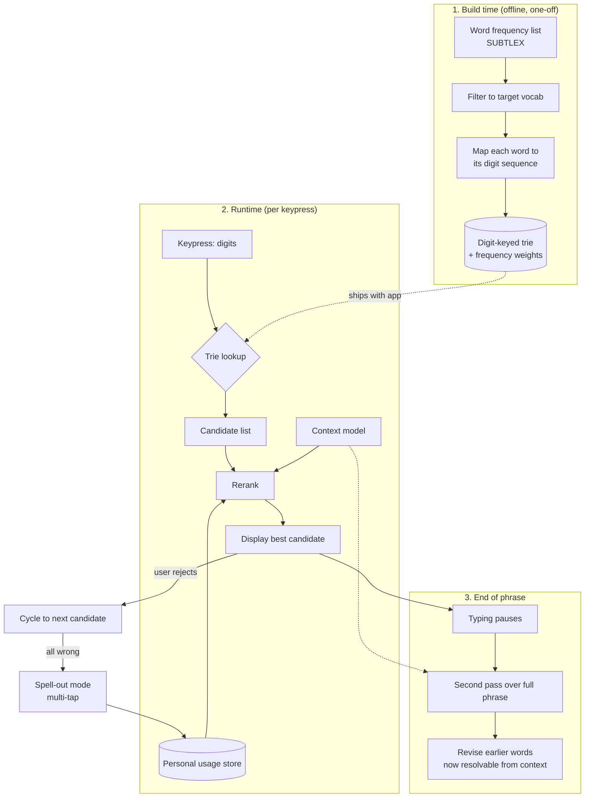

# numpad-words
Predictive text mapping for 9-key/numeric keypads powered by the SUBTLEX frequency corpus.

https://github.com/emrysr/numpad-words

# demo

vue proof of concept app:

https://numpad-words.vercel.app/


# get started

clone this repo and run the vite app:
`npm run dev`

or use the node.js tui to get the same lookup in the terminal
`npm run tui`


# keypad-predict

Single-tap text entry for a numeric keypad, in the browser.

A T9-style input method built as a proof of concept for hardware with no room for a
full keyboard. Each key covers three or four letters, one press per letter, and the
system works out which word you meant.

The difference from classic T9 is the ranking: instead of picking the most frequent
match from a static dictionary, candidates are scored against the sentence so far.

**Status:** exploratory. Nothing here is stable yet.

## Feature set

What's actually implemented today, in the Vue app (`npm run dev`):

- **Predictive typing.** `2`-`9` compose a digit sequence; the trie resolves it to
  ranked dictionary candidates, best one shown immediately.
- **Cycling.** `*` cycles through same-length candidates. Alternates also show as
  tags below the sentence and are clickable directly.
- **Accept.** `0`/space finalizes the current word so the next digit starts a new one.
- **Delete.** `#` removes the last digit, then the previous word once the current
  one is empty. Long-press `#` clears the whole input.
- **Literal digit insert.** Long-press any number key to insert that digit as a
  character; consecutive long-presses merge into one token (e.g. a phone number).
- **Key `1` punctuation.** Always-available multi-tap through `.,?!'-/@&`, even
  outside manual mode: repeated taps cycle the symbol, auto-committing after a
  pause or when another key is pressed.
- **Manual multi-tap spelling mode.** Long-press `*` to enter classic Nokia-style
  multi-tap: repeated taps cycle a key's letters (or symbols, on key `1`), auto-committing
  after a pause. This is the escape hatch for any word the dictionary doesn't have,
  including ones with digits or symbols in it (e.g. an email address).
- **Custom word learning.** Words spelled in manual mode are remembered per-device
  (`localStorage`) and merged into the trie, so they're offered as normal predictive
  candidates on every future visit.
- **Completion prediction.** The trie also predicts a likely *full* word before its
  digits are fully typed (e.g. predicting `something` after just `s`,`o`,`m`), offered
  as a separate selectable suggestion rather than pre-empting real candidates.
- **Installable PWA.** Works offline; a manifest, icons, and a service worker
  precache the trie so first-load-then-offline works out of the box.
- **In-app tips.** A native `<dialog>`-based help panel keeps usage tips out of the
  main UI until asked for.
- **Terminal harness.** `npm run tui` exercises the prediction logic without a
  browser, for quick manual testing of trie behaviour.
- **Reusable as a component.** Emits `update:modelValue` with the composed text, and
  the keypad buttons take class props (`buttonClass`/`numberButtonClass`/
  `symbolButtonClass`) plus a scoped `#button` slot for restyling - see
  [`docs/01.vue-component.md`](docs/01.vue-component.md).

## Why

The target hardware has space for a numpad-sized key matrix and not much else.
Shrinking a full QWERTY down to that footprint gives unusably small key targets, so
the trade is fewer keys with bigger targets, plus prediction to recover the lost
information.

The browser version exists to answer the usability questions before any hardware
gets built.

## How it works

Three stages. The trie is the hard constraint throughout — ranking only ever chooses
among words the keypresses actually allow, so the system can't produce a word you
didn't type.



### Build time

A frequency list goes in, each word is converted to its digit sequence (`home` →
`4663`), and out comes a compact digit-keyed trie with weights baked in. Ships with
the app. No ML, just data prep.

### Runtime

Digits go into the trie, a ranked candidate list comes out. Reranking uses the
personal usage store and a context model scoring each candidate against the sentence
so far. Best one displays immediately and converges as more presses narrow the set.

### End of phrase

Once typing pauses, a second pass runs over the whole phrase with full context and
can revise earlier words. `4663` is ambiguous between *good* and *home*; "I'm going
home" is not.

## Design decisions

| Decision | Choice | Reasoning |
|---|---|---|
| Vocabulary | SUBTLEX | Subtitle frequencies match how people write messages better than book-derived corpora |
| Size | ~50k words | Covers >95% of everyday text; 100k mostly adds rare words and raises collision rate |
| Serialisation | JSON | Inspectable, one-line load. Move to binary only if load time actually hurts |
| Structure | Plain trie | ~2MB at 50k words, fine in a browser. DAWG later, when squeezing onto hardware |
| Ranking | n-gram first | Needs a score per keypress in milliseconds. Reach for a neural model only if n-grams demonstrably fall short |

### On WebLLM

Originally the plan was a fine-tuned small model via WebLLM. Parked, for now.

WebLLM is inference-only — fine-tuning happens offline and the result is compiled to
MLC format, which is a real piece of work. More importantly, a chat-shaped model is
probably the wrong tool for scoring a handful of candidates on every keypress. An
n-gram table is a few megabytes and answers in microseconds.

Revisit if the phrase-level rescoring pass turns out to need real context modelling.

## Open questions

These are what the proof of concept is for.

- **No selection key.** The target hardware may not have a spare key for cycling
  candidates. Long-press or double-tap on `0` is the cheapest escape hatch — it costs
  no keys and the thumb is already there after every word.
- **How often does prediction strand you?** Build the no-cycle version first and
  measure. The error rate decides whether the hardware needs an escape hatch at all.
- **Screen space.** Unclear whether there's room to show a candidate list. Fake the
  real dimensions with a fixed-size container and find out.
- **Spell-out fallback.** Multi-tap letter entry as the guarantee that any word can
  be typed. Slow, but without it some words — names especially — are unreachable.
  Words entered this way go into the personal store so the cost is paid once.

## Keymap

Standard ITU E.161 layout, plus `*`/`#` for cycle/delete.

```
1 .,?!     2 ABC     3 DEF
4 GHI      5 JKL     6 MNO
7 PQRS     8 TUV     9 WXYZ
* next     0 space   # del
```

Every key also does something extra on long-press: a number inserts its own digit
as a literal character, `#` clears the whole input, and `*` toggles manual
multi-tap spelling mode (see "Feature set," above) for words the dictionary
doesn't have.

## Metrics

Two numbers to beat, established with the trie alone before any ranking is added:

- **Keystrokes per character (KSPC).** Perfect single-tap entry is 1.0. Every cycle
  press or spell-out pushes it up.
- **Top-1 accuracy.** How often the first displayed candidate is the intended word,
  measured against a held-out corpus.

## Roadmap

1. ✅ Build script: SUBTLEX → digit-keyed trie → JSON
2. ✅ Runtime lookup: digits in, ranked candidates out
3. ✅ Browser harness with a fixed-size display matching target hardware
4. Baseline KSPC and top-1 accuracy, frequency ranking only
5. ✅ Personal usage store — via manual-mode spelling + per-device `localStorage`,
   rather than the originally-imagined usage-frequency reranking
6. n-gram reranking, measure the delta
7. Phrase-level rescoring pass
8. Decide on the escape hatch from real error rates — resolved: long-press `*` for
   manual multi-tap spelling, long-press a number/`#` for literal digits/reset

## Future improvements

Ideas beyond the original roadmap above, roughly in order of how self-contained
they are:

- ✅ **Emit the final text value.** `update:modelValue` lets a host page read/store
  the composed sentence via `v-model`, and the keypad buttons take class props plus
  a scoped slot for restyling. See [`docs/01.vue-component.md`](docs/01.vue-component.md).
  Still open: the rest of the UI (colors, sentence/candidate-tag markup, tips
  dialog) is still fixed, Bulma-derived, scoped CSS, not yet exposed the same way.
- **Publish as an npm package.** The core logic (`src/lib/keymap.ts`, `trie.ts`,
  `customWords.ts`) is already framework-agnostic; the Vue component is a thin UI
  layer on top of it. Package the lib functions - and optionally the component - for
  reuse elsewhere, with a real public API and semver instead of living only inside
  this app.
- **Port to Python/MicroPython.** The actual target hardware (see "Why," above) is a
  microcontroller-class device, not a browser. The trie format is plain JSON and the
  lookup/ranking logic is simple enough to reimplement directly in MicroPython,
  letting the same digit-keyed trie run on real numpad hardware with no JS runtime
  at all.
- **n-gram/context reranking and phrase-level rescoring.** Still-unimplemented ideas
  from the original roadmap (items 6-7) — worth revisiting once there's real usage
  data to show whether frequency-only ranking is actually the bottleneck.

## Prior art

T9 was commercially owned by Tegic for its entire relevant life, and by the time the
patents stopped mattering, touchscreens had made full keyboards possible and the
demand evaporated. The result is that no stable open implementation exists — what's
out there is student projects and abandoned npm packages.

Worth a look regardless:

- [`asterics/predictionary`](https://github.com/asterics/predictionary) — learning
  JavaScript word prediction. Letter-prefix keyed rather than digit-keyed, so not a
  drop-in, but the adaptation layer is the interesting part.
- [`rvsandeep/T9Implementation`](https://github.com/rvsandeep/T9Implementation) —
  uses `0` for space and `*` to cycle, and explicitly flags that frequency counts
  should be per-user rather than corpus-wide.
- The [`t9` topic](https://github.com/topics/t9) on GitHub for the wider field.

## Licence

TBD
